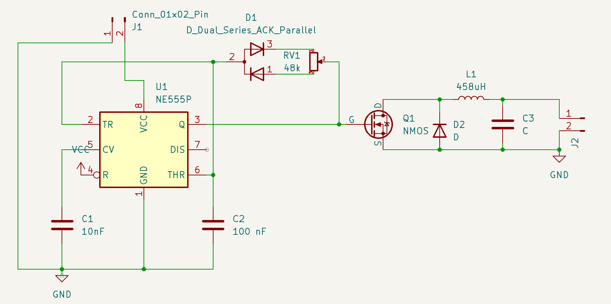

# **Zeezzaq**
# ***Buck Converter Using TLC555 and IRF3708***
---

This project showcases a buck converter circuit designed using the TLC555 timer IC and the IRF3708 MOSFET. The circuit efficiently steps down voltage from 24V to 5V while maintaining a maximum current of 1A, resulting in a power output of 24W. Below you will find the schematic, component list, and information about the students involved in this project.

## Project Overview

A buck converter is a DC-DC power converter that steps down voltage from its input to its output. This design leverages the TLC555 as a PWM generator to drive the switching of the IRF3708 MOSFET, enabling efficient voltage conversion from 24V to 5V.

## Specifications

- *Input Voltage*: 24V
- *Input Current*: Max 1A (24W)
- *Output Voltage*: 5V
- *Output Power*: Max 5W

## Schematic

The schematic above shows the key components:
- *TLC555*: Timer IC used to generate the pulse-width modulation (PWM) signal.
- *IRF3708*: N-channel MOSFET used as the main switching device.
- Other passive components (capacitors, inductors, resistors) are used to filter the output and ensure stable voltage regulation.

## Components

- TLC555 Timer IC
- IRF3708 N-channel MOSFET
- Inductor
- Capacitors
- Diodes
- Resistors

## Working Principle

1. The *TLC555* generates a PWM signal, which controls the duty cycle of the MOSFET.
2. The *IRF3708 MOSFET* acts as the switch in the buck converter, toggling between on and off states based on the PWM signal.
3. The inductor and capacitor filter the output, converting the PWM signal into a stable 5V DC output from the 24V input.

## Contributers

Shashank Naik
60002220111
           
Yash Doke
60002220058
     
Mihir Sanghvi 
60002230125

Om Kulkarni 
60002231053

## How to Use

1. Assemble the circuit as per the schematic.
2. Connect the 24V input voltage (ensure it does not exceed 1A).
3. Observe the 5V output voltage, which is designed to supply up to 1A.

## License

This project is licensed under the MIT License - see the [LICENSE](LICENSE) file for details.
